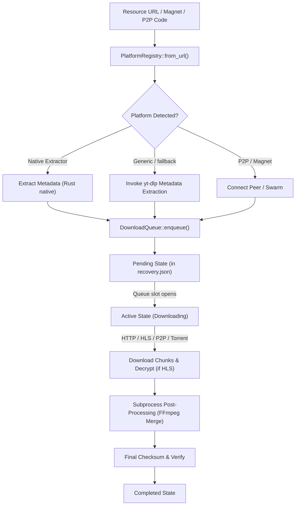

# 🏗️ Technical Architecture

MangoFetch is engineered as a modern, modular download ecosystem written in **Rust**. It utilizes a multi-crate workspace to decouple core downloading logic from the terminal and graphical interfaces.

## 📦 Project Structure

The codebase is organized into four core crates:

1. **`mangofetch-core`**: The central download engine.
   - UI-agnostic and fully asynchronous (built on `tokio`).
   - Contains the **Download Queue Manager** (`queue.rs`) which schedules active downloads, manages execution concurrency slots, and saves recovery states to `recovery.json` for crash safety.
   - Implements native high-performance engines:
     - **Direct Downloader**: Multi-segment parallel HTTP downloader with zero-copy buffer pools.
     - **HLS Downloader**: Custom M3U8 parser supporting AES-128 segment decryption (using `aes` and `cbc` block ciphers) and parallel chunk fetching.
     - **BitTorrent Engine**: Integrated via `librqbit` for magnet links and torrent files.
     - **P2P Transfer Engine**: A secure TCP node-to-node protocol utilizing multi-threaded streaming.
   - Handles external subprocess orchestration for **FFmpeg** and **yt-dlp**.
   - Includes the **Dependency Engine** which auto-checks, updates, and cryptographically verifies external binaries via SHA256 checksums (`tool_hashes.json`).
   - Houses the **Plugin Manager** that dynamically loads custom plugins at runtime.

2. **`mangofetch-plugin-sdk`**: The development SDK.
   - Defines the standard Application Binary Interface (ABI) and traits for writing dynamic plugins.
   - Exposes serialization models for plugin manifests, events, and configuration settings.

3. **`mangofetch-cli`**: The command-line entrypoint.
   - Implements CLI commands and option parsing via `clap`.
   - Implements the interactive Terminal User Interface (TUI) powered by `ratatui` with support for custom color themes, scrolling, log streaming, and mouse interaction.

4. **`mangofetch-gui`**: The desktop graphical application.
   - Built on **`egui`** and **`eframe`** (v0.31) for a lightweight, cross-platform visual interface that communicates natively with `mangofetch-core`.

---

## 🔄 Download Lifecycle

When a URL or file resource is queued, it goes through the following lifecycle:

1. **Resolution & Classification**:
   - `Platform::from_url` determines the handling engine (e.g. native parsers, BitTorrent, P2P, or `yt-dlp` fallback).
2. **Metadata Extraction**:
   - The engine retrieves stream URLs, titles, and resolutions without pulling media payloads.
3. **Task Queueing**:
   - The task enters the `DownloadQueue` with states: `Pending`, `Downloading`, `Paused`, `Completed`, or `Failed`.
   - The session state is serialized to `recovery.json` after every state change.
4. **Segment Fetching & I/O**:
   - HTTP segments are fetched concurrently and written to disk.
   - For HLS streams, the native engine handles decryption of segments using dynamic keys.
5. **Post-Processing**:
   - If audio and video are separate streams (e.g. VP9 + Opus), `ffmpeg` is launched with hardware acceleration overrides (automatically detecting CUDA, VAAPI, or VideoToolbox) to mux streams without re-encoding.
6. **Persistence & Finalization**:
   - Completed files are placed in the output directory and session logs are finalized.

---

## ⚡ Technical Highlights

### 🖥️ Native Decrypting HLS Downloader
Unlike basic downloaders that spawn Python wrapper processes, MangoFetch has a native HLS engine in Rust. It fetches the `.m3u8` playlist, resolves relative segment URIs, decrypts segments on-the-fly using `cbc-aes`, and merges them with minimal overhead.

### 🛡️ Secure Subprocess Sandboxing
Subprocess invocations to external binaries like `yt-dlp` or `ffmpeg` sanitize arguments strictly, preventing shell-injection vectors. Path lengths and filenames are normalized using the `sanitize-filename` crate.

### 🔌 Extensibility via Dynamic Link Libraries (DLLs)
The plugin engine loads compiled shared libraries (`.so`, `.dll`, `.dylib`) at runtime using `libloading`. An ABI version check ensures compatibility before any function pointers are invoked.
